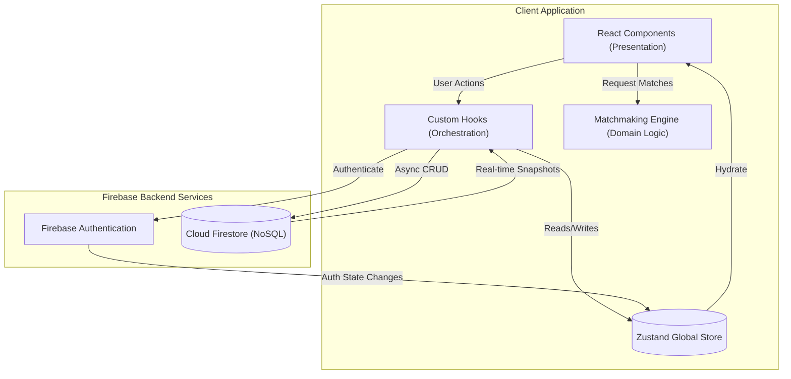

<!--
  TDC Matchmaker Portal — Professional README
  Generated: June 9, 2026
-->

[]()
[]()
[]()
[]()
[]()

# TDC Matchmaker Portal — Enterprise Internal CRM & Automated Matchmaking

A premium, production-ready internal CRM and automated matchmaking platform exclusively developed for **The Date Crew (TDC)** matchmakers. 

Designed for scalability, data density, and extremely rapid evaluation workflows, this application completely digitizes the traditional, manual matchmaking process. It replaces fragile, spreadsheet-driven operations with a secure, cloud-based portal. This repository contains a complete Single Page Application (SPA) utilizing a highly optimized React frontend built on Vite, heavily reliant on a sophisticated Layered Clean Architecture pattern, Zustand for precise global state management, and Firebase as a robust Backend-as-a-Service (BaaS) for real-time data synchronization and authentication.

---

## Table of Contents

- [Project Overview](#project-overview)
- [The Matchmaking Engine (Deep Dive)](#the-matchmaking-engine-deep-dive)
- [Key Features](#key-features)
- [Tech Stack](#tech-stack)
- [UI / UX Highlights](#ui--ux-highlights)
- [System Architecture](#system-architecture)
- [Folder Structure](#folder-structure)
- [Authentication & Role-Based Access Control](#authentication--role-based-access-control)
- [Environment Variables](#environment-variables)
- [Installation & Local Development](#installation--local-development)
- [Deployment Guide](#deployment-guide)
- [Database Schema & Architecture](#database-schema--architecture)
- [Security & Best Practices](#security--best-practices)
- [Performance & Scaling](#performance--scaling)

---

## Project Overview

The **TDC Matchmaker Portal** is a specialized B2B SaaS-style application constructed to streamline, secure, and accelerate the complex daily workflows of professional Indian matchmakers. 

### The Core Problem Being Solved
Traditional Indian matchmaking involves evaluating an overwhelming number of highly nuanced variables. A matchmaker must cross-reference a client's hard constraints (Age, Height, Income boundaries) with their soft preferences (Family Values, Dietary habits, Lifestyle choices like smoking or drinking) and cultural prerequisites (Religion, Caste, Manglik status). Doing this manually across a pool of thousands of profiles is exceptionally tedious, prone to human bias, and computationally impossible for a human to optimize perfectly.

### The TDC Solution
This portal serves as a centralized, highly secure command center. It acts as both a **Client Relationship Manager (CRM)** and a **Deterministic Match Calculation Engine**. 

**Key Value Propositions:**
1. **Unbiased Algorithmic Surfacing:** The application programmatically evaluates all potential partners in the database against the client's biodata, generating a ranked list of statistically compatible matches.
2. **Human-In-The-Loop Final Approval:** The algorithm does not send matches automatically. Instead, it surfaces the *best* candidates to the professional matchmaker, providing a detailed "Breakdown" of precisely *why* the match scored highly, explicitly outlining "Strengths" and "Concerns". The matchmaker then makes the final human judgment call.
3. **Workflow Centralization:** From adding new clients, to tracking whether a client is `Active`, `Paused`, or `Matched`, to leaving internal timestamped notes — everything is centralized in one auditable dashboard.

---

## The Matchmaking Engine (Deep Dive)

The defining feature of this application is its proprietary **Matchmaking Algorithm**, isolated entirely within the `src/engine/` directory. This engine is a deterministic scoring system that takes a target `client` object and an entire `pool` array, comparing them to yield a mathematically ranked array of matches.

The scoring is broken down into modular functions inside `scorer.js`. The final score is a weighted average of the following critical compatibility pillars:

1. **Age Compatibility:** Enforces asymmetrical logic based on gender norms (e.g., scoring male profiles against female profiles differently than female against male). It applies strict penalties if a candidate falls outside the client's stated `partnerAgeMin/Max` boundaries.
2. **Height Compatibility:** Similar to age, this utilizes gender-based asymmetrical scoring, punishing vast height disparities or mismatches against stated hard boundaries (`partnerHeightMinCm`).
3. **Income & Education:** Evaluates `annualIncomeLakh` against structured income bands. Education evaluates institutional tiers and awards bonuses if both candidates share similar fields of study (e.g., Engineering, Medicine).
4. **Cultural & Religious Alignment:** Uses a highly specific matrix (`RELIGION_COMPAT`) to evaluate inter-faith matches. It includes intricate Manglik scoring (e.g., both Manglik = 100%, one Manglik vs one Non-Manglik = severe penalty).
5. **Values & Lifestyle:** Analyzes Dietary preferences (Vegetarian, Jain, Vegan, Non-Veg) alongside Drinking, Smoking, and Pet ownership tolerances. Evaluates "Nuclear" vs "Joint" family structures.
6. **Relocation & Logistics:** Determines compatibility between NRI (Non-Resident Indian) status and willingness to relocate across cities or international borders.

Once scored, the `ranker.js` function sorts the profiles and assigns them a **Tier** (Exceptional, Strong, Good, Potential) based on their final mathematical breakdown. The `explainer.js` then translates the numerical breakdown into plain English sentences, arming the matchmaker with talking points for their clients.

---

## Key Features

- **Matchmaker Authentication**
  - Secure login, registration, and session management using Firebase Authentication.
  - Persistent sessions utilizing secure JWT mechanisms maintained by Firebase's native SDK.
  
- **Advanced Dashboard CRM**
  - A responsive, paginated, and highly searchable dashboard view of all assigned clients.
  - Client-side filtering logic allowing matchmakers to instantly filter by lifecycle status (`New`, `Active`, `On Hold`, `Matched`, `Paused`) or search across names, cities, and companies without incurring database read costs.
  - Aggregate statistics showing total clients, newly onboarded clients this month, and successful matches.

- **Comprehensive Client Management**
  - Intuitive modals for adding new clients or editing existing extensive biodata.
  - Tracking of over 40 distinct datapoints per client divided into: Personal Information, Professional Background, Lifestyle & Values, Cultural Background, Partner Preferences, and Family Details.
  - Internal **Notes Panel** utilizing optimistic UI updates, allowing matchmakers to leave timestamped remarks that append to the client's document via `arrayUnion` operations.

- **Match Viewing & Actioning**
  - Real-time generation of matches displayed in detailed "Match Cards".
  - One-click copy-to-clipboard functionality powered by `introGenerator.js`, which dynamically crafts a personalized WhatsApp/Email introduction template incorporating the specific strengths of the match.

- **Premium UI / UX Design**
  - The entire interface is built strictly adhering to a bespoke design system mapped in `tailwind.config.js`.
  - Color palettes specifically utilize TDC brand guidelines: Gold variants (`#dc9e4a`), Charcoal dark themes (`#1a1814`), and Ivory/Cream backgrounds for maximum readability and a luxury feel.
  - Complex keyframe animations (`fade-up`, `slide-in`, `scale-in`) and heavily customized box-shadows elevate the user interaction model beyond standard SaaS tools.

---

## Tech Stack

The architecture leverages a modern, highly performant React stack designed to prioritize developer experience and end-user speed.

- **Frontend Core:** React 18, utilizing functional components and React Hooks heavily.
- **Build Tooling:** Vite v5, chosen for its near-instant Hot Module Replacement (HMR) and highly optimized Rollup-based production builds.
- **Routing:** React Router DOM v6, implementing protected routes and declarative component hierarchies.
- **State Management:** Zustand v4. Lightweight, unopinionated, and blazingly fast. Replaces Redux for a simpler, boilerplate-free global state that ties directly into Firebase snapshot listeners.
- **Styling Engine:** Tailwind CSS v3, coupled with PostCSS and Autoprefixer. Includes deep customization for custom fonts (Playfair Display, Inter Tight).
- **Backend Infrastructure:** Firebase v10 SDK.
  - **Firebase Auth:** Handles all user identity, password hashing, and token rotation natively.
  - **Cloud Firestore:** A NoSQL document database used for real-time, optimistic data synchronization.
- **Testing:** Vitest and React Testing Library (configured, ready for coverage expansion).

---

## System Architecture

The repository enforces a strict **Layered Clean Architecture**, heavily decoupling business logic from UI components. This ensures that the proprietary matching algorithm could theoretically be ported to a Node.js backend or React Native app with zero modifications.

1. **Presentation Layer (`src/components/`, `src/pages/`)**
   - Strictly responsible for rendering data and capturing user intent. 
   - Components are further divided into `layout/` (structural shells), `ui/` (dumb, generic buttons/inputs), and `features/` (domain-specific, smart components like `ClientRow`).
   
2. **Global State Layer (`src/store/`)**
   - Implemented via Zustand. Stores are segregated by domain: `authStore`, `clientStore`, `matchStore`, `uiStore`.
   - **Optimistic UI Principle:** When a matchmaker updates a client's status or adds a note, the `clientStore` instantly mutates the UI state. The asynchronous Firestore write occurs silently in the background, making the app feel instantaneously fast.

3. **Hooks Layer (`src/hooks/`)**
   - Custom hooks act as the orchestrators between the Firebase Service Layer and the Zustand State Layer. 
   - `useClientsLoader()` seamlessly handles setting up and tearing down real-time WebSocket subscriptions to Firestore based on the authenticated user's ID.

4. **Service / Backend Layer (`src/firebase/`)**
   - Encapsulates all third-party SDK calls. Components never import `firebase/firestore` directly; they call internal helper functions exported from `firestore.js`.

5. **Domain Logic Engine (`src/engine/`)**
   - Pure, deterministic JavaScript functions. This layer holds the entirety of the intellectual property of the TDC Matchmaker algorithm. It relies on no external dependencies.

### Architecture Diagram



---

## Folder Structure

A comprehensive view of the meticulously organized `src/` directory:

```text
tdc-matchmaker/
├─ src/
│  ├─ __tests__/        # Setup and configurations for Vitest
│  ├─ components/       
│  │  ├─ features/      # Highly complex domain components (e.g., BiodataSection, AddClientModal)
│  │  ├─ layout/        # Persistent shell components (e.g., AppShell sidebar & headers)
│  │  └─ ui/            # Reusable primitive atomic components (Button, Input, Badge, Spinner)
│  ├─ data/             
│  │  ├─ profiles.js    # Highly detailed JSON array acting as the mocked candidate pool
│  │  └─ seed.js        # Script to programmatically inject dummy clients into Firestore
│  ├─ engine/           # The Matchmaking Domain Logic
│  │  ├─ index.js       # The singular public API boundary for the engine module
│  │  ├─ scorer.js      # Granular mathematical scoring functions per compatibility pillar
│  │  ├─ ranker.js      # Applies overarching weights and calculates final percentages
│  │  ├─ constants.js   # Immutable lookup matrices (Religion grids, income bands)
│  │  ├─ explainer.js   # Translates numerical variance into human-readable pros/cons
│  │  └─ introGenerator.js # Constructs rich-text WhatsApp introduction templates
│  ├─ firebase/         
│  │  ├─ config.js      # App initialization, local caching directives for Firestore
│  │  ├─ auth.js        # Authentication wrappers (signIn, signUp, signOut)
│  │  └─ firestore.js   # CRUD operations, query builders, and snapshot listeners
│  ├─ hooks/            # (useAuth, useClients, useMatches)
│  ├─ pages/            # Top-level route boundaries (DashboardPage, ClientDetailPage, LoginPage)
│  ├─ store/            # Zustand global slice definitions
│  ├─ App.jsx           # Master route configuration via React Router DOM
│  └─ main.jsx          # React DOM entry point and strict mode wrapper
├─ firestore.rules      # Crucial backend security rules
├─ tailwind.config.js   # The absolute source of truth for the TDC Design System
├─ vercel.json          # Instructions for Vercel deployment and security headers
└─ vite.config.js       # Bundler instructions, chunk splitting, and test configs
```

---

## Authentication & Role-Based Access Control

Security is paramount given the highly sensitive nature of client biodata and personal preferences.

**Authentication Flow:**
- Managed natively by Firebase. Passwords are never sent to our servers; they are processed via Google's secure authentication infrastructure.
- The `useAuthListener` hook in `hooks/useAuth.js` is attached at the absolute root of the application in `App.jsx`. It listens for Firebase token changes and hydrates the `authStore`. If a user is not authenticated, all protected routes (`/dashboard`, `/clients/*`) immediately redirect to `/login`.

**Authorization & Row-Level Security:**
- The frontend does not trust the user. Security is enforced mathematically at the database layer via `firestore.rules`.
- Every `client` document inserted into the database is stamped with an `assignedMatchmakerId` field, which matches the creating user's Firebase UID.
- The rules actively reject any read or write request where the requester's UID does not exactly match the document's `assignedMatchmakerId`. This makes it physically impossible for matchmaker A to view, edit, or leak the clients belonging to matchmaker B, even if they manipulate the frontend API requests.

---

## Environment Variables

For local development and deployment, a `.env.local` file must be created at the root of the repository. Vite requires the `VITE_` prefix to expose these safely to the bundled client application.

```env
# Firebase Configuration — Retrieve these from the Firebase Console > Project Settings > Web App
VITE_FIREBASE_API_KEY=your_api_key_here
VITE_FIREBASE_AUTH_DOMAIN=your-project.firebaseapp.com
VITE_FIREBASE_PROJECT_ID=your-project-id
VITE_FIREBASE_STORAGE_BUCKET=your-project.appspot.com
VITE_FIREBASE_MESSAGING_SENDER_ID=1234567890
VITE_FIREBASE_APP_ID=1:123456:web:abcdef
```

*Note: In the context of a Firebase frontend application, these keys are intended to be public. They identify your project to Google's servers. The actual security of your data is entirely dependent on your `firestore.rules`, NOT the secrecy of these keys.*

---

## Installation & Local Development

### Prerequisites
- Node.js >= 18.0.0
- npm >= 9.x
- A Google Firebase account with an active project. You must enable **Authentication (Email/Password)** and **Cloud Firestore** in your Firebase console.

### Step-by-Step Setup

1. **Clone the repository**
   ```bash
   git clone <repository-url>
   cd tdc-matchmaker
   ```

2. **Install all dependencies**
   ```bash
   npm install
   ```

3. **Configure the Environment**
   Duplicate the `.env.local.example` file and rename it to `.env.local`. Fill in the values from your Firebase console.

4. **Deploy Security Rules**
   You must push the `firestore.rules` to your Firebase project to secure your database. You can do this via the Firebase CLI:
   ```bash
   firebase deploy --only firestore:rules
   ```

5. **Spin up the Development Server**
   ```bash
   npm run dev
   ```
   Vite will instantly start a hot-reloading development server on `http://localhost:3000`.

### Initial Seeding
When a matchmaker logs in for the very first time and their assigned client list is totally empty `(clients.length === 0)`, the `useClientsLoader` hook will dynamically import `src/data/seed.js` and automatically inject a robust list of dummy clients into the Firestore database, assigned specifically to that matchmaker's UID. This allows for immediate testing and evaluation of the portal.

---

## Deployment Guide

This application is strictly an SPA (Single Page Application) generating static assets. It is optimized for deployment on Vercel.

**Vercel Deployment Workflow:**
1. Connect your GitHub/GitLab repository directly to a new Vercel project.
2. Under "Environment Variables" in Vercel settings, input all of your `VITE_FIREBASE_*` keys.
3. Vercel will automatically detect Vite and run `npm run build`.
4. **Critical:** The `vercel.json` file included in the root directory ensures that Vercel routes all requests `/(.*)` back to `/index.html`. This is mandatory for React Router DOM to function correctly and prevents 404 errors on deep links.
5. The `vercel.json` also aggressively applies production security headers, including `X-Content-Type-Options: nosniff`, `X-Frame-Options: DENY`, and strict CORS/Permissions-Policies to prevent Clickjacking and embedded tracking.

---

## Database Schema & Architecture

The Cloud Firestore database currently operates on two primary collections.

### 1. `clients` Collection
This collection houses the highly mutable documents representing the individuals who have hired the matchmaker.
**Example Schema Shape:**
```javascript
{
  id: "doc-id-123", // Auto-generated by Firestore
  assignedMatchmakerId: "firebase-uid-abc",
  statusTag: "Active", // Enum: New, Active, On Hold, Matched, Paused
  personal: {
    firstName: "Arjun",
    lastName: "Sharma",
    dob: "1994-06-15T00:00:00.000Z", // ISO string for precise age calculation
    gender: "Male",
    heightCm: 178,
    city: "Mumbai",
    religion: "Hindu",
    manglik: "No"
    // ... dietaryPref, smoking, drinking, etc.
  },
  professional: {
    company: "TCS",
    designation: "Software Engineer",
    annualIncomeLakh: 25,
    degree: "B.Tech",
    nriStatus: false
  },
  preferences: {
    partnerAgeMin: 26,
    partnerAgeMax: 30,
    partnerHeightMinCm: 160,
    wantKids: "Yes",
    openToRelocate: "Maybe"
  },
  family: {
    familyType: "Nuclear",
    familyValues: "Moderate"
  },
  notes: [
    { id: "uuid", text: "Client prefers south Mumbai matches", createdAt: "ISO", createdBy: "UID" }
  ],
  sentMatches: ["profile-id-1", "profile-id-5"], // Array of IDs already presented
  createdAt: "2026-05-10T...",
  updatedAt: "2026-06-09T..."
}
```

### 2. `pool` Collection (Future State)
Currently, in Phase 2 of development, the `pool` is loaded directly from a static JSON array located at `src/data/profiles.js` to ensure zero-latency algorithm processing during testing and to completely avoid database read costs for the pool.

In future phases, the `fetchPoolProfiles()` function in `firebase/firestore.js` will be swapped to query a read-only global `pool` collection from Firestore. Due to the Layered Architecture, making this switch will require exactly one function change, and the rest of the application will remain entirely unaffected.

---

## Security & Best Practices

1. **Defensive Firestore Rules:** All logic operates under a strict principle of least privilege. Deletions are hard-blocked (`allow delete: if false;`), meaning data can only be flagged as `Paused`, never destroyed, preserving audit trails.
2. **Immutable Updates:** The Zustand store strictly uses spread operators to execute shallow and deep copies, preventing state mutation bugs.
3. **Optimized Local Caching:** The Firebase SDK is initialized with `persistentLocalCache` utilizing `persistentMultipleTabManager`. This guarantees that if a matchmaker opens the portal in multiple browser tabs, they share a single WebSocket connection to Firebase, vastly reducing bandwidth and read operations. It also allows the app to load instantly from IndexedDB before pinging the network.

---

## Performance & Scaling

- **Aggressive Chunk Splitting:** The Vite configuration explicitly chunks heavy vendor libraries. The `firebase` SDK, `react-router-dom`, and `react` core are all split into isolated manual chunks (`vite.config.js`). This ensures that application updates do not force the user to re-download massive vendor bundles, radically improving cache hits and Time to Interactive (TTI).
- **Client-Side Search:** Filtering the dashboard by text or status executes purely in memory via React `useMemo` hooks. This ensures zero latency and zero database cost when a matchmaker is rapidly sorting through their roster.

---
